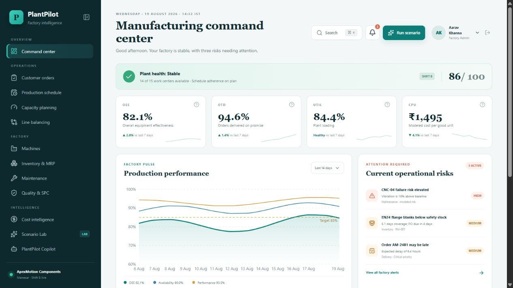

# PlantPilot

## AI Manufacturing Command Center & Digital Factory Simulator

PlantPilot is a production-shaped digital manufacturing platform combining finite-capacity scheduling, discrete-event factory simulation, capacity planning, inventory intelligence, maintenance analytics, statistical process control, cost intelligence, and scenario optimization.



> PlantPilot operates on a realistic synthetic automotive-component manufacturing dataset designed for experimentation, optimization and educational demonstration. No metrics are claimed to originate from a real company or production facility.

## Live production deployment

- PlantPilot frontend: <https://planpilot-factory.vortexblaster.chatgpt.site>
- Render API: <https://plantpilot-api.onrender.com>
- API health: <https://plantpilot-api.onrender.com/health>
- OpenAPI docs: <https://plantpilot-api.onrender.com/docs>

The existing Sites deployment is owner-only. Its production browser bundle uses the Render API above; Render connects privately to `plantpilot-db` PostgreSQL in Singapore. The hosted path is independent of the developer laptop. Free Render services can cold-start, and the free PostgreSQL instance expires on **2026-09-24** unless upgraded or replaced.

## The factory

The demonstration environment represents **ApexMotion Components Pvt. Ltd.**, a fictional automotive-component manufacturer in Manesar, Haryana, India. The deterministic seed contains:

- exactly 15 primary production work centers;
- 60 shift-assigned workers with skills and certifications;
- 8 automotive products with BOMs and multi-operation routings;
- 24 raw materials and consumables from 8 fictional suppliers;
- 420 customer orders and 180 days of history;
- 2,700 machine-day production records and 720 quality inspections.

Synthetic relationships are intentional: heavy utilization increases queue pressure; overdue maintenance and vibration increase modeled failure risk; supplier and material pressure affect release feasibility; quality loss changes cost and yield; and priority changes the scheduling penalty.

## Working modules

| Area | Capability |
| --- | --- |
| Command Center | Calculated OEE, availability, performance, quality, OTD, utilization, WIP, scrap, downtime, overtime, inventory value, and cost |
| Orders | Search, filter, create, update, production requirements, material requirements, progress, risk, and CSV export |
| Planning & Scheduling | OR-Tools CP-SAT flexible job-shop schedule, Gantt, priority-weighted tardiness, precedence, eligible machines, maintenance, and setup-family duration |
| Capacity | Required vs available hours, overload, spare capacity, targeted overtime, heatmap, and ranked bottlenecks |
| Line Balancing | Ranked Positional Weight, precedence-safe station assignment, efficiency, delay, idle time, and smoothness index |
| Inventory & MRP | BOM explosion, projected balance, safety stock, reorder point, EOQ-based recommendation, coverage, supplier, and modeled purchase value |
| Maintenance | Condition-based Random Forest risk, vibration, temperature, runtime, overdue PM, MTBF, MTTR, and suggested windows |
| Quality & SPC | X-bar and R inputs, Cp/Cpk, rejection rate, control limits, Pareto analysis, scrap, and rework |
| Cost Intelligence | Material, labor, machine, energy, setup, maintenance, scrap, order margin, downtime, and modeled opportunity |
| Scenario Lab | Baseline vs disrupted vs recommended states using SimPy, with saved runs, KPI deltas, actions, and modeled financial impact |
| PlantPilot Copilot | Deterministic, source-grounded fallback without an API key; optional external-LLM configuration path |
| Reports & Admin | Executive brief, CSV/text exports, notifications, planning settings, audit log, and demo reset |

## Architecture

```text
React 19 + TypeScript + vinext UI
              │
              ▼
FastAPI REST API ─────────────── PostgreSQL / SQLite
       │                                │
       ├── OR-Tools CP-SAT              ├── normalized master data
       ├── SimPy simulation             ├── 180-day event history
       ├── scikit-learn                  └── schedule/scenario/audit state
       └── KPI, MRP, SPC, cost services
```

The browser application also contains a deterministic offline demonstration dataset so a portfolio preview remains navigable. In Docker, the command-center KPIs and trends, all 420 orders, authenticated order writes, CP-SAT Gantt results, and Scenario Lab comparisons are loaded from FastAPI/PostgreSQL. See [Architecture](docs/ARCHITECTURE.md), [Optimization](docs/OPTIMIZATION.md), and [Simulation](docs/SIMULATION.md).

## Algorithms

- **Scheduling:** CP-SAT optional intervals, exactly-one eligible-machine assignment, precedence constraints, machine `NoOverlap`, fixed maintenance, makespan, weighted tardiness, and family-specific setup duration.
- **Simulation:** SimPy processes for jobs, queues, setups, machine resources, disruption delays, labor effects, quality effects, completion, cost, overtime, WIP, and lateness.
- **Line balancing:** Ranked Positional Weight with transitive successor weights and precedence-safe station loading.
- **MRP:** BOM explosion against remaining open quantity, projected balance, safety stock, reorder point, coverage, and EOQ-informed purchase recommendations.
- **Maintenance:** deterministic Random Forest classifier over synthetic vibration, temperature, runtime, days overdue, and modeled load.
- **SPC:** X-bar/R summaries, three-sigma limits, rejection rate, Cp, Cpk, and cumulative Pareto contribution.

## Run with Docker

Prerequisite: Docker Desktop is running.

```bash
git clone https://github.com/VorteXEkansh/plantpilot.git
cd plantpilot
cp .env.example .env
docker compose up --build
```

On Windows PowerShell, use `Copy-Item .env.example .env` instead of `cp`.

- Web: <http://localhost:3000>
- API: <http://localhost:8000>
- OpenAPI docs: <http://localhost:8000/docs>

Demo login:

```text
Email: admin@plantpilot.local
Password: PlantPilot@2026
```

## Native development

```powershell
npm install
npm run dev

python -m venv .venv
.\.venv\Scripts\python.exe -m pip install -r apps\api\requirements.txt
cd apps\api
..\..\.venv\Scripts\python.exe -m alembic -c alembic.ini upgrade head
..\..\.venv\Scripts\python.exe -m scripts.init_db
..\..\.venv\Scripts\python.exe -m uvicorn app.main:app --reload
```

## Verification

```bash
# API, KPI, optimization, simulation, and integration tests
cd apps/api && pytest

# Frontend
npm run lint
npm run typecheck
npm test
npx playwright test

# Full browser/API/PostgreSQL integration (Docker Compose must be running)
PLANTPILOT_API_INTEGRATION=1 npx playwright test

# Production configuration
docker compose config
docker compose up --build
```

CI runs migrations, data initialization, backend tests, type checking, linting, the production web build, rendered HTML tests, and Playwright smoke tests.

## Demonstration story

The flagship scenario removes CNC-04 for 12 hours. The production cloud test across 32 active orders changed modeled OTD from **62.5% disrupted** to **65.6% recommended**, reduced average lateness from **14.5 to 12.2 hours**, released **11 modeled WIP units**, reduced modeled cost by **₹6,187**, and required **1.8 additional targeted overtime hours**. The unchanged baseline OTD was **71.9%**. These are simulation results in the PlantPilot synthetic factory, not realized savings.

Use the [case study](docs/CASE_STUDY.md) and [interview guide](docs/INTERVIEW_GUIDE.md) for a defensible walkthrough.

## Documentation

- [Architecture](docs/ARCHITECTURE.md)
- [Industrial Engineering concepts](docs/INDUSTRIAL_ENGINEERING.md)
- [Optimization model](docs/OPTIMIZATION.md)
- [Simulation model](docs/SIMULATION.md)
- [Synthetic data](docs/SYNTHETIC_DATA.md)
- [Maintenance model card](docs/MODEL_CARD.md)
- [Project case study](docs/CASE_STUDY.md)
- [Project report](docs/PROJECT_REPORT.md)
- [CV bullets](docs/CV_BULLETS.md)
- [Interview guide](docs/INTERVIEW_GUIDE.md)
- [Deployment](docs/DEPLOYMENT.md)

## Limitations

- Synthetic correlations demonstrate system behavior but do not validate industrial causal claims.
- Material feasibility is checked at the planning/release layer instead of embedded in every CP-SAT interval.
- Setup-family duration is machine/product-specific; full pairwise sequence-dependent transition matrices are a documented extension.
- The maintenance model has no real failure labels and must not be used to control real maintenance.
- The simulation is a decision-support model, not a commissioned digital twin.

## License

[MIT](LICENSE)
